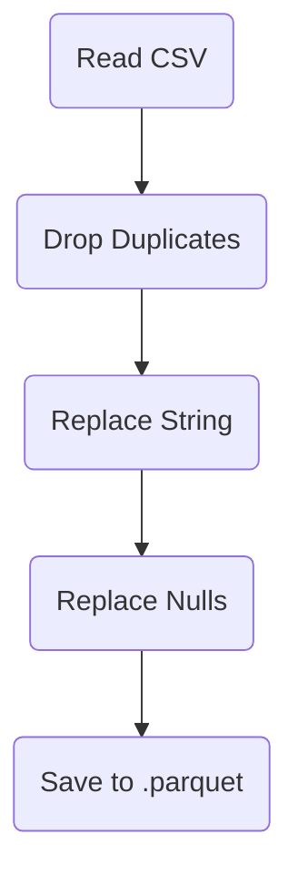

# pandas_vs_pyspark_polars

```mermaid
graph TB
    Start(Read CSV) --> step1(Drop Duplicates)
    step1(Drop Duplicates) --> step2(Replace String)
    step2(Replace String) --> step3(Replace Nulls)
    step3(Replace Nulls) --> step4(Save to .parquet)
```

